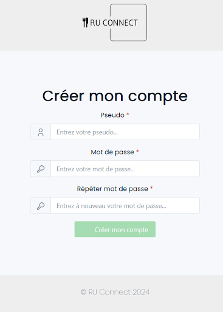

<h1 align="center">User Manual</h1>
<h4 align="center">Ariane Nicolas - Kilian Marcelin - Rémi Cazoulat - Axel Allain</h4>

Quand vous arrivez sur RU Connect, vous devez vous créer un compte avec un nom d’utilisateur et un mot de passe pour pouvoir accéder à toutes les fonctionnalités de l’application. Si vous vous déconnectez pendant votre navigation, vous pourrez toujours vous connecter à nouveau avec vos identifiants.

Lors de votre première connexion sur l’application, le ‘Swipe&Taste’ apparaît à l’écran. Une liste d’ingrédients va défiler devant l’utilisateur, et ce dernier va pouvoir cliquer soit à gauche s’il les apprécie soit à droite dans le cas contraire. Du côté du système, certains menus seront donc recommandés en fonction des choix de l’utilisateur.

Vous arrivez ensuite sur la page principale de l’application. Cette page vous renseigne sur les différents stands du jour (et ceux de demain et d’après-demain). En cliquant sur un des boutons STAND, vous serez redirigé vers une page affichant une description détaillée des ingrédients du stand.
Il y a aussi un histogramme permettant de visualiser rapidement à quelle heure le restaurant universitaire sélectionné (ici l’Astrolabe) aura le moins de temps de queue. Vous pouvez changer de restaurant universitaire en cliquant sur le bouton à droite du nom de celui sélectionné. Vous pouvez aussi regarder les temps de queue de tous les restaurants en cliquant sur le bouton “Queues aux autres RU” en dessous de l'organigramme. En cliquant sur l’image en haut à droite (Ici marquée “PS”) vous accédez à votre profil.

En cliquant sur la bulle en haut à gauche avec les initiales puis sur ‘mon profil’, vous arriverez sur la page Profil avec plusieurs informations. Vous pourrez voir votre pseudo et le modifier, consulter votre statut (A faim, dans la queue, dans le RU) et le modifier, ainsi que voir le statut de vos amis. A terme, il sera plus simple de modifier son statut à l’aide d’une pop-up arrivant sur le devant de l’application.

